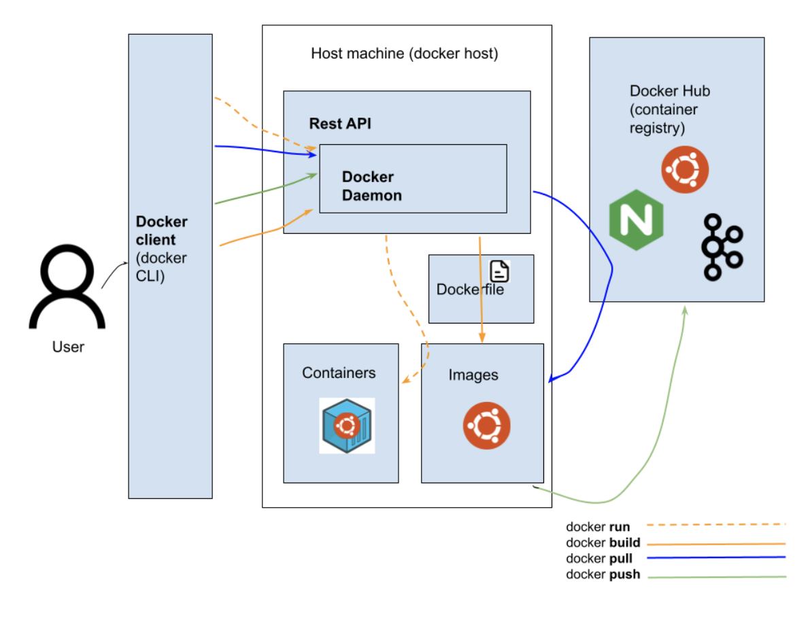

## Introduction

Docker has gained huge popularity among other container engines since it was released to the public in 2013. Here are some of the reasons why Docker so darn popular:

- _Improved portability_

Docker containers can be shipped and run across environments be it local machine, on-prem or	cloud instances in the form of Docker images. Compared to docker containers, LXC containers have more machine specifications.
- _Lighter weight_

Docker images are light weight compared to VM images. For example, an Ubuntu 18.04 VM size is about 3GB whereas the docker image is 45MB!

- _Versioning of container images_

Docker supports maintaining multiple versions of images which makes it easier to look up the history of an image and even rollback.

- _Reuse of images_

Since Docker images are in the form of layers, one image can be used as base on top of which new images are built. For example, [Alpine](https://hub.docker.com/_/alpine) is a light weight image (5MB) which is commonly used as a base image. Docker layers are managed using [storage drivers](https://docs.docker.com/storage/storagedriver/).

- _Community support_

Docker hub is a container registry where anyone logged in can upload or download a container image. Docker images versions of popular OS distros are regularly updated in docker hub and receive large community support.

Let’s look at some terms which come up during our discussion of Docker.

## Docker terminology

- _Docker images_

Docker image contains the executable version of the application along with the dependencies (config files, libraries, binaries) required for the application to run as a standalone container. It can be understood as a snapshot of a container.
Docker images are present as layers on top of the base layer. These layers are the ones that are versioned. The most recent version of layer is the one that is used on top of the base image.

`docker image ls` lists the images present in the host machine.

- _Docker containers_

Docker container is the running instance of the docker image. While images are static, containers created from the images can be executed into and interacted with. This is actually the “container” from the previous sections of the module.

`docker run`  is the command used to instantiate containers from images.

`docker ps` lists docker containers currently running in the host machine.

- _Docker file_

It is a plain text file of instructions based on which an image is assembled by docker engine (daemon, to be precise). It contains information on base image, ENV variables to be injected.

`docker build` is used to build images from dockerfile.

- _Docker hub_

It is Docker’s official container registry of images. Any user with a docker login can upload custom images to Docker hub using `docker push` and fetch images using `docker pull`.

Having known the basic terminologies let’s look at how docker engine works; how CLI commands are interpreted and container life-cycle is managed.

## Components of Docker engine

Let’s start with the diagram of Docker Engine to understand better:

The docker engine follows a client-server architecture. It consists of 3 components:

- _Docker client_

This is the component the user directly interacts with. When you execute docker commands which we saw earlier (push, pull, container ls, image ls) , we are actually using the docker client. A single docker client can communicate with multiple docker daemons.

- _REST API_

Provides an interface for the docker client and daemon to communicate.

- _Docker Daemon (server)_

This is the main component of the docker engine. It builds images from dockerfile, fetches images from docker registry, pushes images to the registry, stops, starts containers etc. It also manages networking between containers.

## LAB

The official [docker github](https://github.com/docker/labs) provides labs at several levels for learning Docker. We're linking one of the labs which we found great for people beginning from scratch. Please follow the labs in this order:

1. [Setting up local environment for the labs](https://github.com/docker/labs/blob/master/beginner/chapters/setup.md)

2. [Basics for using docker CLI](https://github.com/docker/labs/blob/master/beginner/chapters/alpine.md)

3. [Creating and containerizing a basic Flask app](https://github.com/docker/labs/blob/master/beginner/chapters/webapps.md)

Here is another [beginner level lab](https://www.katacoda.com/courses/docker/2) from Katacoda  for dockerizing a node js application. You don’t even need a local setup for this and it’s easy to follow along.

## Advanced features of Docker

While we have covered the basics of containerization and how a standalone application can be dockerized, processes in the real world need to communicate with each other. This need is particularly prevalent in applications which follow a microservice architecture.  

**Docker networks**

Docker networks facilitate the interaction between containers running on the same hosts or even different hosts. There are several options provided through docker network command which specifies how the container interacts with the host and with other containers. The host option allows sharing of network stack with the host, bridge allows communication between containers running on the same host but not to external to the host, overlay facilitates interaction between containers across hosts attached to the same network and macvlan which assigns a separate MAC address to a container for legacy containers are some important types of networks supported by Docker.  This however is outside the scope of this module. The official documentation on [docker networks](https://docs.docker.com/network/) itself is a good place to start.

**Volumes**

Apart from images, containers and networks, Docker also provides the option to create and mount volumes within containers. Generally, data within docker containers is non-persistent i.e once you kill the container the data is lost. Volumes are used for storing persistent data in containers. This [KataKoda lab](https://www.katacoda.com/courses/docker/persisting-data-using-volumes) is a great place to start playing with volumes.

[In the next section](https://linkedin.github.io/school-of-sre/orchestration_with_kubernetes/) we see how container deployments are orchestrated with Kubernetes.
